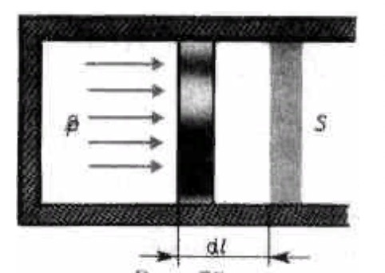

# Экзамен по Физике 3 Модуль 2023

## Навигация по странице

- **Начальная термодинамика.**

  - [1.1 - Термодинамическое состояние системы, равновесный, обратимый и необратимый, круговой процессы.](#11---%D1%82%D0%B5%D1%80%D0%BC%D0%BE%D0%B4%D0%B8%D0%BD%D0%B0%D0%BC%D0%B8%D1%87%D0%B5%D1%81%D0%BA%D0%BE%D0%B5-%D1%81%D0%BE%D1%81%D1%82%D0%BE%D1%8F%D0%BD%D0%B8%D0%B5-%D1%81%D0%B8%D1%81%D1%82%D0%B5%D0%BC%D1%8B-%D1%80%D0%B0%D0%B2%D0%BD%D0%BE%D0%B2%D0%B5%D1%81%D0%BD%D1%8B%D0%B9-%D0%BE%D0%B1%D1%80%D0%B0%D1%82%D0%B8%D0%BC%D1%8B%D0%B9-%D0%B8-%D0%BD%D0%B5%D0%BE%D0%B1%D1%80%D0%B0%D1%82%D0%B8%D0%BC%D1%8B%D0%B9-%D0%BA%D1%80%D1%83%D0%B3%D0%BE%D0%B2%D0%BE%D0%B9-%D0%BF%D1%80%D0%BE%D1%86%D0%B5%D1%81%D1%81%D1%8B)

  - [1.2 - Законы Бойля-Мариотта, Гей-Люссака, Шарля, Дальтона, Авагадро.](#12---%D0%B7%D0%B0%D0%BA%D0%BE%D0%BD%D1%8B-%D0%B1%D0%BE%D0%B9%D0%BB%D1%8F-%D0%BC%D0%B0%D1%80%D0%B8%D0%BE%D1%82%D1%82%D0%B0-%D0%B3%D0%B5%D0%B9-%D0%BB%D1%8E%D1%81%D1%81%D0%B0%D0%BA%D0%B0-%D1%88%D0%B0%D1%80%D0%BB%D1%8F-%D0%B4%D0%B0%D0%BB%D1%8C%D1%82%D0%BE%D0%BD%D0%B0-%D0%B0%D0%B2%D0%B0%D0%B3%D0%B0%D0%B4%D1%80%D0%BE)
  - [1.3 - Уравнение состояния идеального газа.](#13---%D1%83%D1%80%D0%B0%D0%B2%D0%BD%D0%B5%D0%BD%D0%B8%D0%B5-%D1%81%D0%BE%D1%81%D1%82%D0%BE%D1%8F%D0%BD%D0%B8%D1%8F-%D0%B8%D0%B4%D0%B5%D0%B0%D0%BB%D1%8C%D0%BD%D0%BE%D0%B3%D0%BE-%D0%B3%D0%B0%D0%B7%D0%B0)
  - [1.4 - Основное уравнение молекулярно-кинетической теории.](#14---%D0%BE%D1%81%D0%BD%D0%BE%D0%B2%D0%BD%D0%BE%D0%B5-%D1%83%D1%80%D0%B0%D0%B2%D0%BD%D0%B5%D0%BD%D0%B8%D0%B5-%D0%BC%D0%BE%D0%BB%D0%B5%D0%BA%D1%83%D0%BB%D1%8F%D1%80%D0%BD%D0%BE-%D0%BA%D0%B8%D0%BD%D0%B5%D1%82%D0%B8%D1%87%D0%B5%D1%81%D0%BA%D0%BE%D0%B9-%D1%82%D0%B5%D0%BE%D1%80%D0%B8%D0%B8)
  - [1.5 - Средняя квадратичная скорость и средняя энергия.](#15---%D1%81%D1%80%D0%B5%D0%B4%D0%BD%D1%8F%D1%8F-%D0%BA%D0%B2%D0%B0%D0%B4%D1%80%D0%B0%D1%82%D0%B8%D1%87%D0%BD%D0%B0%D1%8F-%D1%81%D0%BA%D0%BE%D1%80%D0%BE%D1%81%D1%82%D1%8C-%D0%B8-%D1%81%D1%80%D0%B5%D0%B4%D0%BD%D1%8F%D1%8F-%D1%8D%D0%BD%D0%B5%D1%80%D0%B3%D0%B8%D1%8F)
  - [1.6 - Температура как мера кинетической энергии молекул.](#16---%D1%82%D0%B5%D0%BC%D0%BF%D0%B5%D1%80%D0%B0%D1%82%D1%83%D1%80%D0%B0-%D0%BA%D0%B0%D0%BA-%D0%BC%D0%B5%D1%80%D0%B0-%D0%BA%D0%B8%D0%BD%D0%B5%D1%82%D0%B8%D1%87%D0%B5%D1%81%D0%BA%D0%BE%D0%B9-%D1%8D%D0%BD%D0%B5%D1%80%D0%B3%D0%B8%D0%B8-%D0%BC%D0%BE%D0%BB%D0%B5%D0%BA%D1%83%D0%BB)

- **Элементы статистичекой физики.**

  - [2.1 - Вероятность состояния, статистическое распределение.](#21---%D0%B2%D0%B5%D1%80%D0%BE%D1%8F%D1%82%D0%BD%D0%BE%D1%81%D1%82%D1%8C-%D1%81%D0%BE%D1%81%D1%82%D0%BE%D1%8F%D0%BD%D0%B8%D1%8F-%D1%81%D1%82%D0%B0%D1%82%D0%B8%D1%81%D1%82%D0%B8%D1%87%D0%B5%D1%81%D0%BA%D0%BE%D0%B5-%D1%80%D0%B0%D1%81%D0%BF%D1%80%D0%B5%D0%B4%D0%B5%D0%BB%D0%B5%D0%BD%D0%B8%D0%B5)

  - [2.2 - Функция распределения. Условие нормировки для функции распределения. Свойства функции распределения.](#22---%D1%84%D1%83%D0%BD%D0%BA%D1%86%D0%B8%D1%8F-%D1%80%D0%B0%D1%81%D0%BF%D1%80%D0%B5%D0%B4%D0%B5%D0%BB%D0%B5%D0%BD%D0%B8%D1%8F-%D1%83%D1%81%D0%BB%D0%BE%D0%B2%D0%B8%D0%B5-%D0%BD%D0%BE%D1%80%D0%BC%D0%B8%D1%80%D0%BE%D0%B2%D0%BA%D0%B8-%D0%B4%D0%BB%D1%8F-%D1%84%D1%83%D0%BD%D0%BA%D1%86%D0%B8%D0%B8-%D1%80%D0%B0%D1%81%D0%BF%D1%80%D0%B5%D0%B4%D0%B5%D0%BB%D0%B5%D0%BD%D0%B8%D1%8F-%D1%81%D0%B2%D0%BE%D0%B9%D1%81%D1%82%D0%B2%D0%B0-%D1%84%D1%83%D0%BD%D0%BA%D1%86%D0%B8%D0%B8-%D1%80%D0%B0%D1%81%D0%BF%D1%80%D0%B5%D0%B4%D0%B5%D0%BB%D0%B5%D0%BD%D0%B8%D1%8F)

  - [2.3 - Среднее значение физической величины.](#23---%D1%81%D1%80%D0%B5%D0%B4%D0%BD%D0%B5%D0%B5-%D0%B7%D0%BD%D0%B0%D1%87%D0%B5%D0%BD%D0%B8%D0%B5-%D1%84%D0%B8%D0%B7%D0%B8%D1%87%D0%B5%D1%81%D0%BA%D0%BE%D0%B9-%D0%B2%D0%B5%D0%BB%D0%B8%D1%87%D0%B8%D0%BD%D1%8B)
  - [2.4 - Распределение Максвелла по компонентам скоростей и по абсолютным скоростям.](#24---%D1%80%D0%B0%D1%81%D0%BF%D1%80%D0%B5%D0%B4%D0%B5%D0%BB%D0%B5%D0%BD%D0%B8%D0%B5-%D0%BC%D0%B0%D0%BA%D1%81%D0%B2%D0%B5%D0%BB%D0%BB%D0%B0-%D0%BF%D0%BE-%D0%BA%D0%BE%D0%BC%D0%BF%D0%BE%D0%BD%D0%B5%D0%BD%D1%82%D0%B0%D0%BC-%D1%81%D0%BA%D0%BE%D1%80%D0%BE%D1%81%D1%82%D0%B5%D0%B9-%D0%B8-%D0%BF%D0%BE-%D0%B0%D0%B1%D1%81%D0%BE%D0%BB%D1%8E%D1%82%D0%BD%D1%8B%D0%BC-%D1%81%D0%BA%D0%BE%D1%80%D0%BE%D1%81%D1%82%D1%8F%D0%BC)
  - [2.5 - График функции распределения по скоростям. Наиболее вероятная скорость. Средняя скорость. Средняя квадратичная скорость.](#25---%D0%B3%D1%80%D0%B0%D1%84%D0%B8%D0%BA-%D1%84%D1%83%D0%BD%D0%BA%D1%86%D0%B8%D0%B8-%D1%80%D0%B0%D1%81%D0%BF%D1%80%D0%B5%D0%B4%D0%B5%D0%BB%D0%B5%D0%BD%D0%B8%D1%8F-%D0%BF%D0%BE-%D1%81%D0%BA%D0%BE%D1%80%D0%BE%D1%81%D1%82%D1%8F%D0%BC-%D0%BD%D0%B0%D0%B8%D0%B1%D0%BE%D0%BB%D0%B5%D0%B5-%D0%B2%D0%B5%D1%80%D0%BE%D1%8F%D1%82%D0%BD%D0%B0%D1%8F-%D1%81%D0%BA%D0%BE%D1%80%D0%BE%D1%81%D1%82%D1%8C-%D1%81%D1%80%D0%B5%D0%B4%D0%BD%D1%8F%D1%8F-%D1%81%D0%BA%D0%BE%D1%80%D0%BE%D1%81%D1%82%D1%8C-%D1%81%D1%80%D0%B5%D0%B4%D0%BD%D1%8F%D1%8F-%D0%BA%D0%B2%D0%B0%D0%B4%D1%80%D0%B0%D1%82%D0%B8%D1%87%D0%BD%D0%B0%D1%8F-%D1%81%D0%BA%D0%BE%D1%80%D0%BE%D1%81%D1%82%D1%8C)
  - [2.6 - Функция распределения по энергиям. Средняя энергия.](#26---%D1%84%D1%83%D0%BD%D0%BA%D1%86%D0%B8%D1%8F-%D1%80%D0%B0%D1%81%D0%BF%D1%80%D0%B5%D0%B4%D0%B5%D0%BB%D0%B5%D0%BD%D0%B8%D1%8F-%D0%BF%D0%BE-%D1%8D%D0%BD%D0%B5%D1%80%D0%B3%D0%B8%D1%8F%D0%BC-%D1%81%D1%80%D0%B5%D0%B4%D0%BD%D1%8F%D1%8F-%D1%8D%D0%BD%D0%B5%D1%80%D0%B3%D0%B8%D1%8F)

- **Первое и второе начала термодинамики.**

  - [3.1 - Внутренняя энергия и степени свободы. Распределение энергии по степеням свободы.](#31---%D0%B2%D0%BD%D1%83%D1%82%D1%80%D0%B5%D0%BD%D0%BD%D1%8F%D1%8F-%D1%8D%D0%BD%D0%B5%D1%80%D0%B3%D0%B8%D1%8F-%D0%B8-%D1%81%D1%82%D0%B5%D0%BF%D0%B5%D0%BD%D0%B8-%D1%81%D0%B2%D0%BE%D0%B1%D0%BE%D0%B4%D1%8B-%D1%80%D0%B0%D1%81%D0%BF%D1%80%D0%B5%D0%B4%D0%B5%D0%BB%D0%B5%D0%BD%D0%B8%D0%B5-%D1%8D%D0%BD%D0%B5%D1%80%D0%B3%D0%B8%D0%B8-%D0%BF%D0%BE-%D1%81%D1%82%D0%B5%D0%BF%D0%B5%D0%BD%D1%8F%D0%BC-%D1%81%D0%B2%D0%BE%D0%B1%D0%BE%D0%B4%D1%8B)

  - [3.2 - Работа газа при изменении его объема.](#32---%D1%80%D0%B0%D0%B1%D0%BE%D1%82%D0%B0-%D0%B3%D0%B0%D0%B7%D0%B0-%D0%BF%D1%80%D0%B8-%D0%B8%D0%B7%D0%BC%D0%B5%D0%BD%D0%B5%D0%BD%D0%B8%D0%B8-%D0%B5%D0%B3%D0%BE-%D0%BE%D0%B1%D1%8A%D0%B5%D0%BC%D0%B0)
  - [3.3 - Теплота. Первое начало термодинамики.](#33---%D1%82%D0%B5%D0%BF%D0%BB%D0%BE%D1%82%D0%B0-%D0%BF%D0%B5%D1%80%D0%B2%D0%BE%D0%B5-%D0%BD%D0%B0%D1%87%D0%B0%D0%BB%D0%BE-%D1%82%D0%B5%D1%80%D0%BC%D0%BE%D0%B4%D0%B8%D0%BD%D0%B0%D0%BC%D0%B8%D0%BA%D0%B8)
  - [3.4 - Молярная теплоемкость. Теплоемкость при постоянном объеме и постоянном давлении.](#34---%D0%BC%D0%BE%D0%BB%D1%8F%D1%80%D0%BD%D0%B0%D1%8F-%D1%82%D0%B5%D0%BF%D0%BB%D0%BE%D0%B5%D0%BC%D0%BA%D0%BE%D1%81%D1%82%D1%8C-%D1%82%D0%B5%D0%BF%D0%BB%D0%BE%D0%B5%D0%BC%D0%BA%D0%BE%D1%81%D1%82%D1%8C-%D0%BF%D1%80%D0%B8-%D0%BF%D0%BE%D1%81%D1%82%D0%BE%D1%8F%D0%BD%D0%BD%D0%BE%D0%BC-%D0%BE%D0%B1%D1%8A%D0%B5%D0%BC%D0%B5-%D0%B8-%D0%BF%D0%BE%D1%81%D1%82%D0%BE%D1%8F%D0%BD%D0%BD%D0%BE%D0%BC-%D0%B4%D0%B0%D0%B2%D0%BB%D0%B5%D0%BD%D0%B8%D0%B8)
  - [3.5 - Уравнение Майера. Уравнение адиабаты идеального газа.](#35---%D1%83%D1%80%D0%B0%D0%B2%D0%BD%D0%B5%D0%BD%D0%B8%D0%B5-%D0%BC%D0%B0%D0%B9%D0%B5%D1%80%D0%B0-%D1%83%D1%80%D0%B0%D0%B2%D0%BD%D0%B5%D0%BD%D0%B8%D0%B5-%D0%B0%D0%B4%D0%B8%D0%B0%D0%B1%D0%B0%D1%82%D1%8B-%D0%B8%D0%B4%D0%B5%D0%B0%D0%BB%D1%8C%D0%BD%D0%BE%D0%B3%D0%BE-%D0%B3%D0%B0%D0%B7%D0%B0)
  - [3.6 - Политропы. Концепция энтропии. Макро - и микросостояния.](#36---%D0%BF%D0%BE%D0%BB%D0%B8%D1%82%D1%80%D0%BE%D0%BF%D1%8B-%D0%BA%D0%BE%D0%BD%D1%86%D0%B5%D0%BF%D1%86%D0%B8%D1%8F-%D1%8D%D0%BD%D1%82%D1%80%D0%BE%D0%BF%D0%B8%D0%B8-%D0%BC%D0%B0%D0%BA%D1%80%D0%BE---%D0%B8-%D0%BC%D0%B8%D0%BA%D1%80%D0%BE%D1%81%D0%BE%D1%81%D1%82%D0%BE%D1%8F%D0%BD%D0%B8%D1%8F)
  - [3.7 - Статистический вес.](#37---%D1%81%D1%82%D0%B0%D1%82%D0%B8%D1%81%D1%82%D0%B8%D1%87%D0%B5%D1%81%D0%BA%D0%B8%D0%B9-%D0%B2%D0%B5%D1%81)
  - [3.8 - Формула Больцмана. Второе начало термодинамики.](#38---%D1%84%D0%BE%D1%80%D0%BC%D1%83%D0%BB%D0%B0-%D0%B1%D0%BE%D0%BB%D1%8C%D1%86%D0%BC%D0%B0%D0%BD%D0%B0-%D0%B2%D1%82%D0%BE%D1%80%D0%BE%D0%B5-%D0%BD%D0%B0%D1%87%D0%B0%D0%BB%D0%BE-%D1%82%D0%B5%D1%80%D0%BC%D0%BE%D0%B4%D0%B8%D0%BD%D0%B0%D0%BC%D0%B8%D0%BA%D0%B8)
  - [3.9 - Тепловой двигатель. Циклы, цикл Карно и его к.п.д. для идеального газа. Различные формулировки второго начала термодинамики.](#39---%D1%82%D0%B5%D0%BF%D0%BB%D0%BE%D0%B2%D0%BE%D0%B9-%D0%B4%D0%B2%D0%B8%D0%B3%D0%B0%D1%82%D0%B5%D0%BB%D1%8C-%D1%86%D0%B8%D0%BA%D0%BB%D1%8B-%D1%86%D0%B8%D0%BA%D0%BB-%D0%BA%D0%B0%D1%80%D0%BD%D0%BE-%D0%B8-%D0%B5%D0%B3%D0%BE-%D0%BA%D0%BF%D0%B4-%D0%B4%D0%BB%D1%8F-%D0%B8%D0%B4%D0%B5%D0%B0%D0%BB%D1%8C%D0%BD%D0%BE%D0%B3%D0%BE-%D0%B3%D0%B0%D0%B7%D0%B0-%D1%80%D0%B0%D0%B7%D0%BB%D0%B8%D1%87%D0%BD%D1%8B%D0%B5-%D1%84%D0%BE%D1%80%D0%BC%D1%83%D0%BB%D0%B8%D1%80%D0%BE%D0%B2%D0%BA%D0%B8-%D0%B2%D1%82%D0%BE%D1%80%D0%BE%D0%B3%D0%BE-%D0%BD%D0%B0%D1%87%D0%B0%D0%BB%D0%B0-%D1%82%D0%B5%D1%80%D0%BC%D0%BE%D0%B4%D0%B8%D0%BD%D0%B0%D0%BC%D0%B8%D0%BA%D0%B8)
  - [3.10 - Приращение энтропии при обратимом и при необратимом процессе.](#310---%D0%BF%D1%80%D0%B8%D1%80%D0%B0%D1%89%D0%B5%D0%BD%D0%B8%D0%B5-%D1%8D%D0%BD%D1%82%D1%80%D0%BE%D0%BF%D0%B8%D0%B8-%D0%BF%D1%80%D0%B8-%D0%BE%D0%B1%D1%80%D0%B0%D1%82%D0%B8%D0%BC%D0%BE%D0%BC-%D0%B8-%D0%BF%D1%80%D0%B8-%D0%BD%D0%B5%D0%BE%D0%B1%D1%80%D0%B0%D1%82%D0%B8%D0%BC%D0%BE%D0%BC-%D0%BF%D1%80%D0%BE%D1%86%D0%B5%D1%81%D1%81%D0%B5)

- **Эффекты взаимодействия**

  - [4.1 - Барометрическая формула.](#41---%D0%B1%D0%B0%D1%80%D0%BE%D0%BC%D0%B5%D1%82%D1%80%D0%B8%D1%87%D0%B5%D1%81%D0%BA%D0%B0%D1%8F-%D1%84%D0%BE%D1%80%D0%BC%D1%83%D0%BB%D0%B0)

  - [4.2 - Длина свободного пробега.](#42---%D0%B4%D0%BB%D0%B8%D0%BD%D0%B0-%D1%81%D0%B2%D0%BE%D0%B1%D0%BE%D0%B4%D0%BD%D0%BE%D0%B3%D0%BE-%D0%BF%D1%80%D0%BE%D0%B1%D0%B5%D0%B3%D0%B0)
  - [4.3 - Реальные газы, теория Ван-дер-Ваальса.](#43---%D1%80%D0%B5%D0%B0%D0%BB%D1%8C%D0%BD%D1%8B%D0%B5-%D0%B3%D0%B0%D0%B7%D1%8B-%D1%82%D0%B5%D0%BE%D1%80%D0%B8%D1%8F-%D0%B2%D0%B0%D0%BD-%D0%B4%D0%B5%D1%80-%D0%B2%D0%B0%D0%B0%D0%BB%D1%8C%D1%81%D0%B0)
  - [4.4 - Фазовые переходы.](#44---%D1%84%D0%B0%D0%B7%D0%BE%D0%B2%D1%8B%D0%B5-%D0%BF%D0%B5%D1%80%D0%B5%D1%85%D0%BE%D0%B4%D1%8B)

---

## Начальная термодинамика.

### 1.1 - Термодинамическое состояние системы, равновесный, обратимый и необратимый, круговой процессы.

[⏫ Наверх](#навигация-по-странице)

**<h4 align="center">Термодинамика это - ...</h4>**

Термодинамика — это раздел физики, изучающий взаимосвязь между теплотой и работой, процессами в системах, и законами, которые регулируют эти процессы. В этом ответе рассмотрим основные понятия начальной термодинамики: термодинамическое состояние системы, равновесный процесс, обратимый и необратимый процесс, круговой процесс.

**<h4 align="center">Термодинамическое состояние системы</h4>**

Термодинамическое состояние системы описывается с помощью термодинамических переменных, таких как давление (P), объем (V), температура (T), энтропия (S) и внутренняя энергия (U). Состояние системы полностью определено, когда все эти переменные известны.

**<h4 align="center">Равновесный процесс</h4>**

Равновесный процесс — это процесс, во время которого система проходит через ряд промежуточных равновесных состояний. В каждом таком состоянии макроскопические параметры системы, такие как давление, объем и температура, остаются постоянными.

**<h4 align="center">Обратимый и необратимый процесс</h4>**

**Обратимый процесс** — это идеализированный процесс, который может быть воспроизведен в обратном направлении без изменения окружающей среды. В реальности такие процессы не существуют, но они являются полезными для анализа и сравнения с реальными процессами.

**Необратимый процесс** — это процесс, который нельзя воспроизвести в обратном направлении без внешнего воздействия на систему и окружающую среду. Большинство реальных процессов являются необратимыми.

**<h4 align="center">Круговой процесс</h4>**

Начальная термодинамика занимается изучением тепловых процессов, взаимосвязи теплоты и работы, а также законами, описывающими эти процессы. В термодинамике существуют различные круговые процессы, среди которых наиболее известны Карно, Отто, Дизель и Стодола. Эти процессы определяются своими характерными параметрами и идеализациями.

**Цикл Карно**: Самый известный идеальный круговой процесс, предложенный французским ученым Сади Карно в 1824 году. Цикл состоит из двух изотермических и двух адиабатических процессов. Важно отметить, что в идеальных условиях цикл Карно имеет наивысший КПД среди всех возможных тепловых двигателей, работающих между двумя тепловыми резервуарами (источник: Ч. С. Киттиль, "Термодинамика").

  

**Цикл Отто**: Цикл Отто является моделью работы четырехтактного бензинового двигателя внутреннего сгорания. В нем можно выделить процессы: адиабатическое сжатие, изохорное добавление тепла, адиабатическое расширение и изохорное удаление тепла. Этот цикл был предложен Николаусом Августом Отто в 1876 году (источник: Хайдар Юсупов, "Двигатели внутреннего сгорания").

  

**Цикл Дизеля**: Основанный на идее Рудольфа Дизеля в 1892 году, этот цикл является моделью работы дизельного двигателя. В цикле Дизеля происходят адиабатическое сжатие, изобарное добавление тепла, адиабатическое расширение и изохорное удаление тепла (источник: Рудольф Дизель, "Теория и построение двигателей с сжатием").

  

[⏫ Наверх](#навигация-по-странице)

---

### 1.2 - Законы Бойля-Мариотта, Гей-Люссака, Шарля, Дальтона, Авагадро.

[⏫ Наверх](#навигация-по-странице)

**Закон Бойля — Мариотта**: для данной массы газа при постоянной температуре произведение давления газа на его объем есть величина постоянная:

$$pV=const$$

при

$$T=const, m=const$$

График зависимости между параметрами состояния газа при постоянной температуре называется **изотермой**. Изотермы в координатах $р, V$ представляют собой гиперболы, расположенные на графике тем выше, чем выше температура, при которой происходит процесс (рис. 62).

Законы Гей-Люссака:

1. Объем данной массы газа при постоянном давлении изменяется линейно с температурой:

$$V=V_0(1+\alpha \cdot t)$$

$$\text{при} \quad p=const, m=const$$

2. Давление данной массы газа при постоянном объеме изменяется линейно с температурой:

**Закон Шарля**:Отношение давления и температуры остаёться неизменным при постоянном объёме газа.
$$V=const$$
$$\frac{P}{T}=const$$

**Закон Дальтона**:Давление смеси газов равно сумме давлений (парциальное давление) каждого из компонентов смеси.
$$P = \sum\limits_{i=1}^n P_i $$

**Закон Авагадро**:В равных объёмах газа находиться одинаковое количество молекул.

[⏫ Наверх](#навигация-по-странице)

---

### 1.3 - Уравнение состояния идеального газа.

[⏫ Наверх](#навигация-по-странице)

Уравнением состояния идеального газа, называется также уравнением Клапейрона—Менделеева.

Уравнение Менделеева-Клапейрона - уравнение состояния для идеального газа, отнесенное к 1 молю газа. В 1874 г. Д. И. Менделеев на основе уравнения Клапейрона объединив его с законом Авогадро, используя молярный объем $V_m$ и отнеся его к 1 молю, вывел уравнение состояния для 1 моля идеального газа:

$$pV= \nu RT$$

где $R$ - универсальная газовая постоянная, которая равна 8,31 $Дж/(моль \cdot К)$ .Константа, численно равная работе расширения одного моля идеального газа в изобарном процессе при увеличении температуры на 1 К. Равна произведению постоянной Больцмана на число Авогадро.

  

С помощью уравнения состояния идеального газа можно исследовать процессы, в которых масса газа и один из параметров - давление, объем или температура - остается постоянным, а изменяются только остальные два и получить теоретически газовые законы для этих условий изменения состояния газа.

Такие процессы называют изопроцессами. Законы, описывающие изопроцессы, были открыты задолго до теоретического вывода уравнения состояния идеального газа.

[⏫ Наверх](#навигация-по-странице)

---

### 1.4 - Основное уравнение молекулярно-кинетической теории.

[⏫ Наверх](#навигация-по-странице)

Основная задача молекулярно-кинетической теории газа заключается в том, чтобы установить соотношение между давлением газа и его микроскопическими параметрами: массой молекул, их средней скоростью и концентрацией. Это соотношение называется основным уравнением молекулярно-кинетической теории газа или кратко — основным уравнением МКТ.
v
В основе молекулярно-кинетической теории лежат три положения.

1. Все вещества образованы из мельчайших частиц — молекул, которые состоят из атомов.

2. Молекулы химического вещества могут быть простыми и сложными, то есть состоять из одного или нескольких атомов. Молекулы и атомы представляют собой электрически нейтральные частицы. При определенных условиях молекулы и атомы могут приобретать дополнительный электрический заряд и превращаться в положительные или отрицательные ионы.

3. Атомы и молекулы находятся в непрерывном хаотическом движении.

Частицы взаимодействуют друг с другом силами, которые имеют электрическую природу. Гравитационное взаимодействие между частицами пренебрежимо мало.

Мы уже выяснили, что причина давления газа на стенки — это удары молекул. Давление напрямую зависит от количества молекул — чем их больше, тем больше ударов о стенки и тем больше давление. А количество молекул в единице объема — это концентрация. Значит, давление газа зависит от концентрации.

Также давление пропорционально квадрату скорости, так как чем больше скорость молекулы, тем чаще она бьется о стенку сосуда. Расчеты показывают, что основное уравнение молекулярно-кинетической теории для идеального газа имеет следующий вид.

Мы уже выяснили, что причина давления газа на стенки — это удары молекул. Давление напрямую зависит от количества молекул — чем их больше, тем больше ударов о стенки и тем больше давление. А количество молекул в единице объема — это концентрация. Значит, давление газа зависит от концентрации.

Также давление пропорционально квадрату скорости, так как чем больше скорость молекулы, тем чаще она бьется о стенку сосуда. Расчеты показывают, что основное уравнение молекулярно-кинетической теории для идеального газа имеет следующий вид.

**<h4 align="center">Основное уравнение МКТ:</h4>**

$$p = nkt$$

$$или$$

$$p =\frac{1}{3} nm_0\vec{v}^2$$

$p$ — давление газа [Па]

$n$ — концентрация [м−3]

$T$ — температура газа [К]

$m_0$ — масса одной молекулы [кг]

$v$ — средняя квадратичная скорость [м/с]

Коэффициент $\frac{1}{3}$ обусловлен трехмерностью пространства: во время хаотического движения молекул все три направления равноправны.

Важный нюанс: средняя квадратичная скорость сама по себе не в квадрате! Ее формула указана выше, а в основном уравнении МКТ (да и не только в нем) она возведена в квадрат. Это значит, что формулу средней квадратичной скорости нужно подставлять не вместо $v^2$, а вместо $v$ — и потом уже возводить эту формулу в квадрат. Это часто провоцирует путаницу.

[⏫ Наверх](#навигация-по-странице)

---

### 1.5 - Средняя квадратичная скорость и средняя энергия.

**Средняя квадратичная скорость** молекул газа является одним из параметров, определяющих его термодинамические свойства. Математическое выражение формулы для средней квадратичной скорости молекул выглядит следующим образом:

$$V_{ср.кв.} = \sqrt{\frac{V_1^2 + V_2^2 + ... + V_n^2}{N}}$$

Скорости молекул имеют самые разные направления, и, какое бы направление мы не взяли, всегда окажется, что по этому направлению и против него движется одинаковое число молекул. Простая сумма скоростей будет равна нулю. Поэтому здесь используется **среднее значение квадрата скорости молекул**.

Квадрат любого ненулевого числа положителен, поэтому значение в приведённой формуле также всегда будет положительным.

Здесь $V_{ср.кв.}$ - средняя квадратичная скорость молекул, $V_1, V_2, ..., V_n$ - скорости отдельных молекул, $N$ - число молекул в системе.

**Средняя кинетическая энергия** молекул газа связана с их температурой и массой. Математическое выражение формулы связи средней кинетической энергии с абсолютной температурой выглядит следующим образом:

$$E_{ср.кин.} = \frac{3}{2}kT$$

Здесь $E_{ср.кин.}$ - средняя кинетическая энергия молекул, $k$ - постоянная Больцмана, $T$ - абсолютная температура.

В расчетах термодинамических свойств газа, часто используются обе формулы, например, для определения давления газа по его объему и средней квадратичной скорости молекул.

[⏫ Наверх](#навигация-по-странице)

---

### 1.6 - Температура как мера кинетической энергии молекул.

**Температура как мера средней кинетической энергии молекул** - это основное положение молекулярно-кинетической теории газов, которая связывает температуру с движением молекул. Температура является мерой средней кинетической энергии молекул, то есть чем выше температура, тем быстрее движутся молекулы и тем выше их средняя кинетическая энергия.

Кинетическая энергия молекул может быть определена с помощью формулы:

$$E_K= \frac{3}{2}kT$$

где $E_K$ - кинетическая энергия, m - масса молекулы, v - скорость молекулы. Из этой формулы следует, что скорость молекулы пропорциональна корню из их кинетической энергии. Таким образом, при повышении температуры, увеличивается средняя кинетическая энергия молекул, что в свою очередь приводит к увеличению их скоростей.

Таким образом, из формулы видно, что температура является мерой кинетической энергии газа.

Мы можем сопаставить уравнения состояния, полченное из экспеременотов с идеальными газами,с основным уравнением молекулярно-кинетической теории идеальных газов. А именно, мы получаем

$$p=\frac{1}{3}nm_0<v_{кв}>^2=nkT$$

$$kT=\frac{m_0<v_{кв}>^2}{3}$$

Учитывая, что средняя кинетическая энергея частицы $E_0$ даётся выражением

$$E_0=\frac{m_0<v_{кв}>^2}{2}$$

мы получаем важное соотноение

$$E_0=\frac{3}{2}kT=\frac{3}{2}\theta$$

[⏫ Наверх](#навигация-по-странице)

---

## Элементы статистичекой физики.

### 2.1 - Вероятность состояния, статистическое распределение.

[⏫ Наверх](#навигация-по-странице)

Статистическая физика - это раздел физики, который изучает свойства систем, состоящих из большого числа частиц. Она использует методы статистики для описания поведения таких систем.

Вероятность состояния - это вероятность того, что система будет находиться в определенном состоянии. В статистической физике состояние системы определяется значением ее макроскопических параметров, таких как температура, давление, объем и т.д.

Статистическое распределение - это распределение вероятностей, которое описывает вероятность того, что система будет находиться в определенном состоянии. Оно может быть определено для различных параметров системы, таких как энергия, численность частиц, импульс и т.д. Статистическое распределение позволяет получить информацию о распределении частиц в системе, и может быть использовано для определения различных свойств системы, таких как ее энтропия, теплоемкость и т.д.

[⏫ Наверх](#навигация-по-странице)

---

### 2.2 - Функция распределения. Условие нормировки для функции распределения. Свойства функции распределения.

[⏫ Наверх](#навигация-по-странице)

Функция распределения:
Пусть имеется $N$ одинаковых макроскопических величин.Предположим, что какая-то характерная для системы велчиина $x$, может принимать дискретные значениия (Дискретными называются данные, множество значений которых конечно или счетно.) $x_1, x_2, .., x_k$ Осуществим однократное измерение во всех этих системах

Макроскопической называется система, образованная огромным числом макрочастиц (молекул, атомов, ионов, электронов). Допустим, $N_1$ измеренийдали результат $x_1$, $N_2$ измеренийдали результат $x_2$, $N_i$ измеренийдали результат $x_i$ ($\sum N_i = N$). Величина $\frac{N_i}{N}$ назыввается относительной частотой появление результата $x_i$. $\displaystyle \lim_{x \to \infty} \frac{N_i}{N} = P_i$ называется вероятностью появления результата $x_i$.
Заметим, что $\sum P_i = \frac{\sum N_i}{N} = 1$

Очевидно, вероятность того факта, что величина $x$ будет обнаружена в малом интервале от $x$ до $x + dx$, зависит от характера самой величины и от ширины выбранного интервала:
$$\displaystyle \lim_{x \to \infty} \frac{N_i}{N} = f(x)dx$$
Здесь $dN$ - чило измерений, в которых величина $x$ имела значения в интервале от $x$ до $x + dx$.

Функция $f(x) = \displaystyle \lim_{x \to \infty} \frac{N_i}{N} \cdot \frac{1}{dx}$ называется функцией распределения величины $x$ или плотностью вероятности.

Если величина $x$ может принимать значения в переделах от $0$ до $\infty$, то очевидно
$$\int _{0} ^{\infty} f(x)dx =1  \quad  (1)$$
так как формула (1) представляеть собой вероятность того, что величина $x$ находится в возможных для неё пределах. Условие (1) називается условием нормировки.

Любая функция распределения обладает следующими свойствами:

1. Она не убывает если $x_1 < x_2$, то $f(x_1) < f(x_2)$
2. Существуют пределы $\displaystyle \lim_{x \to -\infty} f(x) = 0$ и $\displaystyle \lim_{x \to \infty} f(x) = 1$
3. Она в любой точке непрерывана слева $f(x_0 - 0) = \displaystyle \lim_{x \to x_0-0} f(x) = f(x_0)$

[⏫ Наверх](#навигация-по-странице)

---

### 2.3 - Среднее значение физической величины.

[⏫ Наверх](#навигация-по-странице)

Среднее значение физической величины в статистической физике определяется как математическое ожидание этой величины в статистическом ансамбле, который описывает систему. Математическое ожидание - это среднее значение, которое можно получить, усредняя значения величины для всех состояний системы с учетом их вероятностей.

Статистический ансамбль - это совокупность всех возможных микроскопических состояний системы, описывающих ее макроскопические параметры, такие как энергия, объем, численность частиц, импульс и т.д. В статистической физике, статистический ансамбль используется для описания систем, состоящих из большого числа частиц, где точное определение состояния каждой частицы является невозможным

Среднее значение (арифметическое) дискретной физической величины определяют по формуле
$$< a > = \frac{\sum_i N_i a_i }{N}$$
$$< a > = \sum_i P_i a_i $$

[⏫ Наверх](#навигация-по-странице)

---

### 2.4 - Распределение Максвелла по компонентам скоростей и по абсолютным скоростям.

[⏫ Наверх](#навигация-по-странице)

**<h4 align="center">Распределение Максвелла по компонентам скоростей:</h4>**

Распределение Максвелла для вектора скорости $[v_x, v_y, v_z]$ — является произведением распределений для каждого из трех направлений:

где распределение по одному направлению:

$$f(v_X) = \sqrt{\frac{m}{2 \pi k T}} \cdot exp[\frac{-mv_x^2}{2kT}]$$

таким образом:

$$f(v) = \sqrt{\frac{m}{2 \pi k T}} \cdot exp[\frac{-(mv_x^2 + mv_y^2 + mv_z^2)}{2kT}]$$

Это функция распределения носит название закона нормального рапсределения Гаусса.

**<h4 align="center">Распределение Максвелла по абсолютным скоростям:</h4>**

Модуль скорости, v определяется как:
$$v = \sqrt{v_x^2+v_y^2+v_z^2}$$

Таким образом, функция плотности вероятности для модуля скорости равна:
$$f()dv = 4 \pi v^2(\frac{m}{2 \pi k T})^{\frac{3}{2}} \cdot exp[\frac{-mv^2}{2kT}]dv$$

[⏫ Наверх](#навигация-по-странице)

---

### 2.5 - График функции распределения по скоростям. Наиболее вероятная скорость. Средняя скорость. Средняя квадратичная скорость.

[⏫ Наверх](#навигация-по-странице)

**<h4 align="center">График функции распределения по скоростям:</h4>**

  

Функция распределения F(v) молекул газа по абсолютным значениям скоростей была получена Дж.К. Максвеллом и является справедливой для идеального газа, состоящего из одинаковых частиц, находящегося в состоянии равновесия, в отсутствие внешних силовых полей. В этом случае температура, концентрация, давление имеют одинаковое по всей системе значение.

**<h4 align="center">Функция Максвелла F(v) имеет максимум при значении скорости:</h4>**

$$v_{max} = \sqrt{\frac{2KT}{m_0}} = \frac{2RT}{\mu}$$
Это и будет, также наиболее верятная скорость. Заметим что график симметричено относительно наиболее вероятной скорости.

**<h4 align="center">Средняя скорость:</h4>**

$$\overline{V} = \int _{0} ^{\infty}VF(V)dV = \sqrt{\frac{8KT}{\pi m_0}} = \sqrt{\frac{8RT}{\pi \mu}}$$

**<h4 align="center">Средняя значение квадрата скорости:</h4>**

$$\overline{V^2} = \int _{0} ^{\infty}V^2F(V)dV = \frac{3KT}{m_0} = \frac{3RT}{\mu}$$

**<h4 align="center">Средняя квадратичная скорость:</h4>**

$$V_{ср.квад} = \sqrt{\frac{3RT}{\mu}}$$

[⏫ Наверх](#навигация-по-странице)

---

### 2.6 - Функция распределения по энергиям. Средняя энергия.

[⏫ Наверх](#навигация-по-странице)

Запишем функцию распределения Максвелла в виде:

$$f(v) = 4\pi \cdot (\frac{m}{2\pi kT})^{\frac{3}{2}} \cdot {e}^{\frac{-mv^2}{2kT}} \cdot {v^2}$$

Это функция распределения молекул по скоростям, а значит можно составить функцию распределения по кинетическим энергиям. Эта функция нужна для того, чтобы считать среднюю кинетическую энергию движения молекул.

Величина ${\frac{mv^2}{2}}$ уже является кинетической энергией, так как кинетическая энергия равна:

$${E_к} = {\frac{mv^2}{2}}$$

Более того, ${v^2}$ выражается через кинетическую энергию следующим образом:

$${v^2} = {\frac{2E}{m}}$$

Остаётся выразить ${dv}$. Возьмём дифференциал с двух сторон, получим:

$${dE} = {\frac{m}{2} \cdot {2vdv}}$$

Казалось бы, что дифференциал ${dv}$, который нам нужен, уже появился, однако
в формуле осталось ${v}$, поэтому:

$${v} = {\sqrt{\frac{2E}{m}}}$$

Тогда ${dE}$ получится следующим:

$${dE} = {m \sqrt{\frac{2E}{m}}} {dv}$$

Отсюда:

$${dv} = \frac {dE}{\sqrt{2E m}}$$

Осталось написать ${f(E)dE}$:

$$f(E)dE = 4\pi \cdot (\frac{m}{2\pi kT})^{\frac{3}{2}} \cdot {e}^{\frac{-E}{kT}} {\frac{2E}{m}}{\frac {dE}{\sqrt{2E m}}} =$$

$$= 4\pi \cdot (\frac{m}{2\pi kT})^{\frac{3}{2}} \cdot {e}^{\frac{-E}{kT}} {\frac {2\sqrt{E}}{m \sqrt{2E m}} dE}$$

Далее получим fpεq функцию распределения по кинетическим энергиям:

$$f(E) = 4\pi \cdot (\frac{m}{2\pi kT})^{\frac{3}{2}} \cdot {e}^{\frac{-E}{kT}} {\frac{2E}{m}}{\frac {dE}{\sqrt{2E m}}} =$$

$$= 4\pi \cdot (\frac{m}{2\pi kT})^{\frac{3}{2}} \cdot {e}^{\frac{-E}{kT}} {\frac {2\sqrt{E}}{m \sqrt{2E m}}}$$

Пик этой функции соответствует наивероятнейшему значению энергии $E_н.в.$ .
Найти его можно продифференцировав функцию ${f(E)}$

$${E{н.в.}} = \frac {kT}{2}$$

[⏫ Наверх](#навигация-по-странице)

---

## Первое и второе начала термодинамики.

### 3.1 - Внутренняя энергия и степени свободы. Распределение энергии по степеням свободы.

[⏫ Наверх](#навигация-по-странице)

При определении внутренней энергии газа важную роль играет понятие числа степеней свободы молекул. Под числом степеней свободы системы подразумевается число независимых координат, полностью определяющих положение системы в пространстве. В первом приближении молекула газа может быть рассмотрена как материальная точка, обладающая тремя степенями свободы поступательного движения. Однако, такое приближение оказывается справедливым только для одноатомных молекул, для которых можно пренебречь энергией вращательного движения из-за малости ее момента инерции.

В механике многоатомные молекулы принято рассматривать как совокупность жестко связанных материальных точек. Например, двухатомная молекула состоит из двух материальных точек. Такая молекула обладает тремя степенями свободы поступательного движения (тремя координатами центра масс) и двумя степенями свободы вращательного движения вокруг двух осей, перпендикулярных линии связи атомов. Вращение молекулы вокруг третьей оси не учитывается ввиду чрезвычайной малости энергии вращательного движения вокруг этой оси. Это значит, что жесткая двухатомная молекула обладает пятью степенями свободы ($i=5$). Трехатомная нелинейная молекула имеет шесть степеней свободы: три поступательные и три вращательные степени свободы вокруг трех осей симметрии молекулы. Рисунок:

  

**<h4 align="center">Рисунок</h4>**

Считать, что связи атомов в молекулах являются жесткими несправедливо. Поэтому в реальных молекулах следует учитывать также степени свободы колебательного движения атомов в молекулах. Очевидно, что независимо от общего числа степеней свободы три степени свободы молекул всегда поступательные степени свободы. Все три степени свободы равноправны и поэтому естественно полагать, что на каждую степень свободы поступательного движения приходится энергия $\vec{\omega}_1 = \frac {1}{2}kT$ . В классическую статистическую физику Больцман ввел теорему, согласно которой не только на каждую поступательную степень свободы, но и на вращательные степени свободы приходится одинаковая энергия $\vec{\omega}_1 = \frac {1}{2}kT$ . На каждую колебательную степень свободы приходится энергия , т.е в два раза большая энергия, так как колеблющаяся частица обладает не только кинетической также и потенциальной энергией, причем их средние значения одинаковы. С учетом всех степеней свободы молекулы ее средняя энергия может быть выражена формулой:

$$\vec{\omega} = \frac{i}{2}kT$$

где $i$ - сумма чисел поступательных, вращательных и удвоенного числа колебательных степеней свободы молекулы

$$i = i_{пост} + i_{вращ} + 2i_{колеб} $$

В идеальном газе потенциальная энергия взаимодействия молекул равна нулю, поэтому внутренняя энергия идеального газа складывается только из кинетических энергий движения. Внутренняя энергия одного моля газа складывается из энергий $N_A$ молекул:

$$U_m = \frac{i}{2}kTN_A = \frac{i}{2}RT$$

Внутренняя энергия любой массы газа

$$U_m = \frac{m}{M}\frac{i}{2}kTN_A = \nu\frac{i}{2}RT$$

где $M$ — молярная масса; $\nu = \frac{m}{M}$ — количество вещества.

[⏫ Наверх](#навигация-по-странице)

---

### 3.2 - Работа газа при изменении его объема.

[⏫ Наверх](#навигация-по-странице)

Для рассмотрения конкретных процессов найдем в общем виде внешнюю работу, совершаемую газом при изменении его объема. Рассмотрим, например, газ, находящийся под поршнем в цилиндрическом сосуде (рис. 1). Если газ, расширяясь, передвигает поршень на бесконечно малое расстояние $dl$, то производит над ним работу

$$dA = Fdl = pSdl = pdV, $$

где $S$ — площадь поршня, $Sdl=dV$— изменение объема системы. Таким образом, $dA = pdV$

Полную работу $A$, совершаемую газом при изменении его объема от $V_1$ до $V_2$, найдем

  >

**<h4 align="center">Рис. 1.</h4>**

  >

**<h4 align="center">Рис. 2.</h4>**

интегрированием формулы $dA = pdV:$

$$A = \int_{v_1}^{v_2}pdV$$

Результат интегрирования определяется характером зависимости между давлением и объемом газа. Найденное для работы выражение $A = \int_{v_1}^{v_2}pdV$ справедливо при любых изменениях объема твердых, жидких и газообразных тел.

Произведенную при том или ином процессе работу можно изобразить графически с помощью кривой в координатах $р$, $V$ . Например, изменение давления газа при его расширении изобразится кривой на рис. 2. При увеличении объема на $dV$ совершаемая газом работа равна $pdV$, т. е. определяется площадью полоски с основанием $dV$ на рисунке. Поэтому полная работа, совершаемая газом при расширении от объема $V_1$ до объема $V_2$, определяется площадью, ограниченной осью абсцисс, кривой $p = f(V)$ и прямыми $V_1$ и $V_2$.

Графически можно изображать только **равновесные процессы** — процессы, состоящие из последовательности равновесных состояний. Они протекают так, что изменение термодинамических параметров за конечный промежуток времени бесконечно мало. Все реальные процессы неравновесны (они протекают с конечной скоростью), но в ряде случаев неравновесностью реальных процессов можно пренебречь (чем медленнее процесс протекает, тем он ближе к равновесному). В дальнейшем рассматриваемые процессы будем считать равновесными.

[⏫ Наверх](#навигация-по-странице)

---

### 3.3 - Теплота. Первое начало термодинамики.

[⏫ Наверх](#навигация-по-странице)

**Теплота:**

Теплота - это форма энергии, которая передается между системами или телами в результате разности их температур. Теплота может передаваться по тепловому контакту, тепловому излучению или тепловому перемещению среды (конвекции).

Теплота определяет изменение внутренней энергии системы и может проявляться в различных формах, например, как тепловое расширение тел, изменение их температуры или фазовых переходов (плавления, кристаллизации, испарения и конденсации).

Единицей измерения теплоты в системе СИ является джоуль (Дж), но также широко используются другие единицы измерения, такие как калории (кал), британские тепловые единицы (BTU) и другие.

$$ Q = c \cdot m \cdot \Delta T $$

**Первое начало термодинамики:**

Рассмотрим термодинамическую систему, для которой механическая энергия постоянна, а изменяется лишь ее внутренняя энергия.Внутренняя энергия системы может изменяться в результате различных процессов, на пример совершения над системой работы или сообщения ей теплоты.

Так, вдвигая поршень в цилиндр, в котором
находится газ, мы сжимаем этот газ, в результате чего его температура повышается, т. е. тем самым изменяется (увеличивается) внутренняя энергия газа.

С другой стороны, температуру газа и его внутреннюю энергию можно увеличить за счет сообщения ему некоторого количества теплоты — энергии, переданной системе внешними телами путем теплообмена (процесс обмена внутренними энергиями при контакте тел с разными температурами).

Таким образом, можно говорить о двух формах передачи энергии от одних тел к другим: работе и теплоте. Энергия механического движения может превращаться в энергию теплового движения, и наоборот. При этих превращениях соблюдается закон сохранения и превращения энергии; применительно к термодинамическим процессам этим законом и является первое начало термодинамики, установленное в результате обобщения многовековых опытных данных.

Допустим, что некоторая система (газ, заключенный в цилиндр под поршнем), обладая внутренней энергией $U_1$ получила некоторое количество теплоты $Q$ и, перейдя в новое состояние, характеризующееся внутренней энергией $U_2$ , совершила работу $А$ над внешней
средой, т. е. против внешних сил.

Количество теплоты считается положительным, когда оно подводится к системе, а работа — положительной, когда система совершает ее против внешних сил. В соответствии с законом сохранения энергии при любом способе перехода
системы из первого состояния во второе изменение внутренней энергии
$AU= U_2— U$ будет одинаковым и равным разности между количеством теплоты $Q$, полученным системой, и работой $А$, совершенной системой против внешних сил:

$$AU = Q - A$$

или

$$Q = \Delta U + A \qquad (51.1)$$

Уравнение (51.1) выражает первое начало термодинамики: теплота, сообщаемая системе, расходуется на изменение ее внутренней энергии и на совершение ею работы против внешних сил. Выражение (51.1) для элементарного процесса можно записать в виде

$$dQ = dU + pdV, $$

или в более корректной форме

$$\delta Q = dU  + \delta A \qquad (51.2)$$

где

$\delta Q$ — бесконечно малое количество теплоты;

$dU$ — бесконечно малое изменение внутренней энергии системы;

$\deltaА$ — элементарная работа.

В этом выражении $dU$ является полным дифференциалом, а $\delta A$ и $\delta Q$ таковыми не являются. В дальнейшем будем использовать запись первого начала термодинамики в форме (51.2).

Из формулы (51.1) следует, что в СИ количество теплоты выражается в тех
же единицах, что работа и энергия, т. е. в джоулях ( $Дж$ ).

Если система периодически возвращается в первоначальное состояние,
то изменение ее внутренней энергии $AU=0$ . Тогда, согласно первому началу термодинамики,

$$A = Q, $$

т. е. **вечный двигатель первого рода** — периодически действующий двигатель, который совершал бы большую работу, чем сообщенная ему извне энергия, невозможен (одна из формулировок первого начала термодинамики).

[⏫ Наверх](#навигация-по-странице)

---

### 3.4 - Молярная теплоемкость. Теплоемкость при постоянном объеме и постоянном давлении.

[⏫ Наверх](#навигация-по-странице)

---

Молярная теплоемкость вещества – величина, равная количеству теплоты, необходимому для нагревания 1 моля вещества на 1 К:

$$C=\frac{\partial Q}{\nu\cdot dT}$$

где $\nu=\frac{m}{M}$ число молей

Внутренняя энергия одного моля идеального газа, молекулы которого имеют i степеней свободы,

$$E=\frac{i}{2}N_AT=\frac{i}{2}RT \qquad (1) $$

Первое начало термодинамики для одного моля газа можно записать в виде: $\partial Q=dE+pdv$

Для изохорного процесса

$$\partial Q=dE, $$

Откуда теплоёмкость при поcтоянном объёме равна

$$V=const$$

$$C_v=\frac{\partial Q}{dT}=\frac{i}{2}R \qquad (2) $$

Дифференцируя (1) по температуре, получим:

$$C_v=\frac{dE}{dT}=\frac{i}{2}R$$

Молярная теплоемкость при постоянном давлении равна

$$p=const$$

$$\frac{\partial Q}{dT}=\frac{dE}{dT}+p\frac{dV}{dT}$$

Из уравнения Клапейрона-Менделеева для одного моля газа при постоянном давлении:

$$pdV=RdT.$$

Следовательно, с учетом (2)

$$C_p=C_v+R=\frac{i+2}{2}R$$

Отношение теплоемкостей равно:

$$\gamma=\frac{C_p}{C_V}=\frac{i+2}{i}$$

[⏫ Наверх](#навигация-по-странице)

---

### 3.5 - Уравнение Майера. Уравнение адиабаты идеального газа.

[⏫ Наверх](#навигация-по-странице)

**<h4 align="center">Уравнение Майера:</h4>**

Уравнение Майера — это уравнение, связывающее теплоёмкость идеального газа при постоянном давлении с его теплоёмкостью при постоянном объёме. Для газа, взятого в количестве одного моля, соотношение Майера имеет вид:

$$C_{P,m}-C_{V,m}=R,\qquad (M)$$
где
$R$ — универсальная газовая постоянная,
$C_{P,m}$ — молярная теплоёмкость при постоянном давлении,
$C_{V,m}$ — молярная теплоёмкость при постоянном объёме.

**<h4 align="center">Вывод уравнения Майера (если тупой не учи, все равно не поймешь):</h4>**

Молярная теплоёмкость не является однозначной характеристикой вещества, так как согласно первому началу термодинамики переданное телу количество теплоты расходуется не только на изменение внутренней энергии тела $dU$ (приводящее к изменению температуры), но и на работу
$\delta A$, совершённую телом при его расширении:

$${\displaystyle \delta Q=\mathrm {d} U+\delta A,\qquad (1)}$$

В частном случае изохорного процесса (при неизменном объёме тела) работа равна нулю, то есть

$${\displaystyle \delta Q_{V}=\mathrm {d} U,}$$

или, выражая количество теплоты через теплоёмкость (при постоянном объёме) и изменение температуры:

$${\displaystyle \mathrm {d} U=C_{V}\mathrm {d} T.\qquad (2)}$$

В то же время при изобарном процессе (при постоянном давлении) количество теплоты, необходимое, чтобы повысить температуру на такую же величину $dT$

$${\displaystyle \delta Q_{P}=C_{P}\mathrm {d} T,\qquad (3)}$$

превышает в соответствии с уравнением (1) количество теплоты при изохорном процессе на величину совершаемой расширяющейся газом работы:

$$\displaystyle \delta Q_{P}=\mathrm {d} U+\delta A=$$

$$\mathrm {d} U+P\mathrm {d} V=\mathrm {d} U+\mathrm {d} (PV).\qquad (4)$$

В соответствии с законом Джоуля, внутренняя энергия заданного количества идеального газа зависит только от его температуры, поэтому изменение его внутренней энергии при любом процессе выражается через изменение его температуры согласно формуле (2). Следовательно, для одного моля идеального газа соотношение (4) с учётом (2) и (3) имеет вид:

$${\displaystyle C_{P,m}\mathrm {d} T=C_{V,m}\mathrm {d} T+\mathrm {d} (PV_{m})}$$

Далее из уравнения состояния для одного моля идеального газа
${\displaystyle PV_{m}=RT}$ вычисляется работа ${\displaystyle \mathrm {d} (PV_{m})=R\mathrm {d} T}$ и получается приведённое соотношение Майера (М).

**<h4 align="center">Уравнение адиабаты идеального газа:</h4>**

Уравнение адиабаты идеального газа описывает изменение температуры $T$ и давления $P$ газа при адиабатическом (без теплообмена с окружающей средой) процессе.

Уравнение адиабаты для идеального газа имеет вид:

$$ PV^\gamma = \text{const} $$

где $P$ - давление газа, $V$ - его объем, а $\gamma$ - показатель адиабаты, определяемый соотношением:

$$ \gamma = \frac{C_p}{C_v} $$

где $C_p$ - теплоемкость газа при постоянном давлении, а $C_v$ - теплоемкость газа при постоянном объеме.

**<h4 align="center">Вывод уравнения адиабаты идеального газа:</h4>**

Согласно закону Менделеева — Клапейрона для идеального газа справедливо соотношение

$${\displaystyle pV=\nu RT,}$$

где R — универсальная газовая постоянная. Вычисляя полные дифференциалы от обеих частей уравнения, полагая независимыми термодинамическими переменными $$\left(p,V,T\right)$$

получаем

$${\displaystyle p\mathrm {d} V+V\mathrm {d} p=\nu R\mathrm {d} T.}\qquad (3)$$

Если в (3) подставить $dT$ из (2), а затем $dU$ из (1), получим

$${\displaystyle p\mathrm {d} V+V\mathrm {d} p=-p\mathrm {d} V\cdot {\frac {R}{C_{V}}},}$$

или, введя коэффициент

$${\displaystyle {\gamma}=1+{\frac {R}{C_{V}}}}$$

$${\displaystyle {\gamma}\,p\mathrm {d} V+V\mathrm {d} p=0.}$$

Это уравнение можно переписать в виде

$${\displaystyle {\gamma}{\frac {dV}{V}}=-{\frac {dp}{p}},}$$

что после интегрирования даёт:

$${\displaystyle {\gamma}\,\ln V=-\ln p+\mathrm {const} .}$$
Потенцируя, получаем окончательно:

$${\displaystyle p\,\cdot V^{\gamma }=\mathrm {const} ,}$$

что и является уравнением адиабатического процесса для идеального газа.

[⏫ Наверх](#навигация-по-странице)

---

### 3.6 - Политропы. Концепция энтропии. Макро - и микросостояния.

[⏫ Наверх](#навигация-по-странице)

**<h4 align="center">Определение Политропических процессов:</h4>**

Процессы, в которых теплоемкость тела (газа) остается постоянной, называется политропическим ( $C = const$ ).

Из определения ясно, что изохорный и изобарный процессы – политропические процессы, т.к. $C_p$ и $C_v$ - $const$ определяются числом степеней свободы молекулы и не зависят от процессов.

**<h4 align="center">Вывод уравнения политропы</h4>**

Выведем уравнение политропы из первого начала ТД.

$dQ = dU + dA$ , учитывая, что $dU= C_ndT \quad dA=pdV \quad dQ=CdT \Rightarrow$

$\Rightarrow CdT = C_vdT+pdV$ .

Продифференцировав уравнение Клапейрона-Менделеева, получим

$$pdV + Vdp = \nu R dT \quad \to $$
$$\to \quad pdV =\nu RdT - Vdp \quad \to$$

$$\to \quad  CdT=C_vdT + \nu RdT - \nu dp$$

 

$$V = \frac{\nu RdT}{p} \qquad C=C_vdT+ \nu Rdt - \frac{\nu RdT}{p}dP$$

$$(C - C_v -\nu R)dT= -\frac{\nu RT}{p}dP$$

$$\frac{(C - C_v -\nu R)dT}{T} = -\frac{\nu RdP}{P}$$

Проинтегрируем левые и правые части:

$$\ln T^{C - C_v - \nu R} = \ln P^{-\nu R} + const$$

$$\Downarrow$$

$$ln(T^{C - C_v - \nu R} \cdot P^{\nu R}) = const$$

$$\Downarrow$$

$$T^{C - C_v - \nu R} \cdot P^{\nu R} = const$$

Учитывая, что $T = \frac{PV}{\nu R}$ , получим:

$$P^{C - C_V - \nu R} \cdot V^{C - C_V - \nu R} \cdot P^{\nu R} = const$$

$$\Downarrow$$

$$P^{C-C_V} \cdot V^{C-C_V-\nu R} = const$$

Возведем в степень $\frac{1}{C - C_V}$ и получим:

$$pV^{\frac{C - C_V - \nu R}{C - C_V}} = const$$

Учитывая уравнение Майера, где $C_p - C_v = \nu R$, получим:

$$pV^{\frac{C - C_p}{C - C_V}} = const$$

отсюда вытекают наши формулы:

$$\boxed{pV^n = const, \quad n = \frac{C - C_p}{C - C_V}, \quad C = \frac{nC_v - C_p}{n-1}}$$

| Процесс        | Показатель Полинтропы | Формула    |
| -------------- | --------------------- | ---------- |
| Изохорный      | **n= $\infty$**       | -          |
| Изобарный      | **n=0**               | $pV^0$     |
| Изотермический | **n=1**               | $pV = nkT$ |
| Адиабатный     | **n= $\gamma$**       | -          |

**
Макро- и микросостояния
**

**Состояние термодинамической системы**, определяемое характеризующими всю систему в целом макроскопическими параметрами($V,P,T$ и т.д.), называется макросостоянием.

Состояние термодинамической системы, определяемое положением и состоянием всех элементарных частиц ее, называется микросостоянием.

Каждому макросостоянию термодинамической системы в многоатомных системах может соответствовать вликое множество микросостояний.

**Макросостояние идеального газа** в сосуде объемом $V$ при давлении $P$ и температуре $T$ соответствует бесконечное множество различных микросостояний, однозначно определяемых положением и скоростями всех атомов системы. Но как бы велико ни было множество микросостояний, соответствующих данному макросостоянию, оно конечно, что связано с квантовым эффектом неопределенности Гейзенберга, согласно которому элементарная частица в конечном объеме может обладать только дискретными значениями координат и скоростей.

Число различных микросостояний, соответствующих данному макросостоянию, - **статистический вес.**

**Статистический вес** выражается большими цифрами. Так для одного моля вещества при нормальных условиях $\Omega = 10^{6.5 \cdot 10^{24}}$ . Статистический вес – термодинамическая вероятность еще и потому, что все микросостояния данной термодинамической системы равновероятны, а, значит, вероятность макросостояния пропорциональна статистическому весу. Однако, характеризовать вероятность макросотояния неудобно, т.к. она имеет очень большие значения и не обладает свойством аддитивности.

Пусть термодинамическая система состоит из двух подсистем, обладающих статистическими весами. Каждое измикросостояний первой системы может реализоваться совместно с каждым измикросостояний второй подсистемы. Следовательно, всего возможно $\Omega_1 \cdot \Omega_2$ различных комбинаций микросостояний подсистем, каждая из которых является микросостояние всей системы. Таким образом, статистический вес всей системы определяется как $\Omega_1 \cdot \Omega_2$ .

Из свойства логарифма видно, что логарифм статистического веса есть величина аддитивная. Именно величину называют энтропией системы ( $k = 1.23*10^{-23} \frac{Дж}{к}$ ).

**Определим свойства энтропии:**

1. Аддитивность

$$S = S_1 + S_2 = k \cdot \ln \Omega  = k \cdot \ln(\Omega_1 \cdot \Omega_2)$$

2. Энтропия характеризует неупорядоченность системы и является мерой хаоса, т.к. упорядоченное макросостояние может быть осуществлено малым числом микросостояний, а неупорядоченное макросостояние можно реализовать большим числом способов или большимчислом микросостяний.

3. Методами статистической физики можно доказать, что в обратимом процессе $dS_{обр} = \frac{dQ}{T}$ , т.е. элементарное приращение энтропии системы равно отношению элементарного количества теплоты, сообщенной системе в обратимом процессе к абсолютной температуре последней (или элементарному количеству приведенной теплоты).

4. Изменение энтропии, как функции состояния система в любом обратимом процессе, переводящем из состояния 1 в состояние 2, равно приведенному количеству тепла, переданному системе в этом процессе.

$$S_2 - S_1 = \int \frac{dQ}{T}$$

Таким образом в термодинамике под энтропией понимают некую физическую величину, изменение которой равно приведенному количеству тепла равновесного процесса.

[⏫ Наверх](#навигация-по-странице)

---

### 3.7 - Статистический вес.

[⏫ Наверх](#навигация-по-странице)

_Микросостояние_ — это состояние системы, определяемое одновременным заданием координат и импульсов всех составляющих систему частиц.

_Макросостояние_ — это состояние системы, характеризуемое небольшим числом макроскопических параметров.

**Термодинамической вероятностью** или **статистическим весом** макросостояния $W$ - называется число микросостояний, осуществляющих данное макросостояние (или число перестановок одноименных элементов, при которых сохраняется данное макросостояние).

Термодинамическая вероятность $W$ - максимальна, когда система находится в равновесном состоянии.

В состоянии равновесия и термодинамическая вероятность максимальна, и энтропия максимальна. Понятие энтропии впервые было введено для определения меры необратимого рассеивания энергии, меры отклонения реального процесса от идеального.

Энтропия $S$ – аддитивная величина:

$$S = \sum_{i=1}^{n}{S_i}$$

где правая часть уравнения - сумма энтропий тел, входящих в систему.

Вероятность сложного события, есть произведение вероятностей состояний:

$$W = W_1 \cdot W_2$$

где $W_1$ – первое состояни, а $W_2$ – второе состояние.

Аддитивной величиной является логарифм термодинамической вероятности:

$$\ln W = \ln W_1 + \ln W_2 + ... = \sum_{i=1}^{n}{\ln W_i}$$

Поэтому Л. Больцман предложил:

$$S = k \cdot \ln W$$

где $k$ – коэффициент Больцмана. С этой точки зрения энтропия выступает, как мера беспорядочности, хаотичности состояния.

Связь между $S$ и $W$ позволяет несколько иначе сформулировать второе начало термодинамики: наиболее вероятным изменением энтропии является ее возрастание.

[⏫ Наверх](#навигация-по-странице)

---

### 3.8 - Формула Больцмана. Второе начало термодинамики.

[⏫ Наверх](#навигация-по-странице)

Согласно Больцману (1872), энтропия системы и термодинамическая ве- роятность связаны между собой следующим образом:

$$S=klnW \quad (1)$$

где $к$ — постоянная Больцмана.

Таким образом, энтропия определяется логарифмом числа микросостояний, с помощью которых может быть реализовано данное макросостояние. Следовательно, энтропия может рассматриваться как мера вероятности состояния термодинамической системы.Формула Больцмана позволяет дать энтропии следующее статистическое толкование: энтропия является мерой неупорядоченности системы.

**второе начало термодинамики** можно сформулировать как закон возрастания энтропии замкнутой системы при необратимых процессах: любой необратимый процесс в замкнутой системе происходит так, что энтропия системы при этом возрастает.

Можно дать более краткую формулировку второго начала термодинамики: в процессах, происходящих в замкнутой системе, энтропия не убывает. Здесь существенно, что речь идет о замкнутых системах, так как в незамкнутых системах энтропия может вести себя любым образом (убывать, возрастать, оставаться постоянной). Кроме того, отметим еще раз, что энтропия остается постоянной в замкнутой системе только при обратимых процессах. При необратимых процессах в замкнутой системе энтропия всегда возрастает.

Формула Больцмана (1) позволяет объяснить постулируемое вторым началом термодинамики возрастание энтропии в замкнутой системе при нео- братимых процессах: возрастание энтропии означает переход системы из менее вероятных в более вероятные состояния. Таким образом, формула Больцмана позволяет дать статистическое толкование второго начала термодинамики. Оно, являясь статистическим законом, описывает закономерности хаотического движения большого числа частиц, составляющих замкнутую систему.

Укажем еще две формулировки второго начала термодинамики:

1. по Кельвину: невозможен круговой прогресс, единственным результатом которого является превращение теплоты, полученной от нагревателя, в эквивалентную ей работу;

2. по Клаузиусу: невозможен круговой процесс, единственным результатом которого является передача теплоты от менее нагретого тела к более нагретому.

[⏫ Наверх](#навигация-по-странице)

---

### 3.9 - Тепловой двигатель. Циклы, цикл Карно и его к.п.д. для идеального газа. Различные формулировки второго начала термодинамики.

[⏫ Наверх](#навигация-по-странице)

Принцип действия теплового двигателя приведен на рис. 87. От термостата1 сболеевысокойтемпературойТь называемого нагревателем, за цикл отбирается количество теплоты $Q_1$, а термостату с более низкой температурой $Т_2$, называемому холодильником, за цикл передается количество теплоты $Q_2$ , при этом совершается работа $А = Q_1 — Q_2$

  

**Цикл Карно** — цикл, состоящий из четырех последовательных обратимых процессов: изотермического расширения, адиабатного расширения, изотермического сжатия и адиабатного сжатия.

  

Прямой цикл Карно изображен на рис. 89, где изотермические расширение и сжатие заданы соответственно кривыми 1 — 2 и З — 4, а адиабатные расширение и сжатие — кривыми 2—3 и 4—1. При изотермическом процессе $U— const$, поэтому количество теплоты $Q_1$ полученное газом от нагревателя, равно работе расширения $А_{12}$, совершаемой газом при переходе из состояния 1 в состояние 2:

$$A_{12}=\frac{m}{M}RT_1ln\frac{V_2}{V_1}=Q_1$$

При адиабатном расширении 2—3 теплообмен с окружающей средой отсутствует и работа расширения $А_{23}$ совершается за счет изменения внутренней энергии:

$$A_{23}=-\frac{m}{M}C_v(T_2-T_1)$$

Количество теплоты $Q_2$ , отданное газом холодильнику при изотермическом сжатии, равно работе сжатия $А_{34}$:

$$A_{34}=\frac{m}{M}RT_2ln\frac{V_4}{V_3}=-Q_2$$

Работа адиабатного сжатия

$$A_{41}=-\frac{m}{M}C_v(T_1-T_2)$$

Работа, совершаемая в результате кругового процесса:

$$A=A_{12}+A_{23}+A_{34}+A_{41}=$$

$$=Q_1+A_{23}-Q_2-A_{23}=Q_1-Q_2$$

и определяется площадью, тонированной на рис.89.
Термический КПД цикла Карно

$$\eta=\frac{A}{Q_1}=\frac{Q_1-Q_2}{Q_1}$$

Применив уравнение для адиабат 2 — 3 и 4—1, получим

$$T_1V_2^{\gamma-1}=T_12V_3^{\gamma-1},T_1V_1^{\gamma-1}=T_2V_4^{\gamma-1}$$

откуда

$$\frac{V_2}{V_1}=\frac{V_3}{V_4}$$

Подставляя формулы получаем

$$\eta=\frac{Q_1-Q_2}{Q_1}=$$

$$=\frac{\frac{m}{M}RT_1ln\frac{V_2}{V_1}-\frac{m}{M}RT_2ln\frac{V_3}{V_4}}{\frac{m}{M}RT_1ln\frac{V_2}{V_1}}=$$

$$=\frac{T_1-T_2}{T_1}$$

т.е. для цикла Карно КПД действительно определяется только температурами нагревателя и холодильника (доказательство теоремы Карно). Для повышения КПД необходимо увеличивать разность температур нагревателя и холодильника.

---

### 3.10 - Приращение энтропии при обратимом и при необратимом процессе.

[⏫ Наверх](#навигация-по-странице)

**
Вывод формулы для приращения энтропии:
**

[⏫ Наверх](#навигация-по-странице)

---

## Эффекты взаимодействия

### 4.1 - Барометрическая формула.

[⏫ Наверх](#навигация-по-странице)

Молекулы любого газа находятся в поле тяготения

[⏫ Наверх](#навигация-по-странице)

---

### 4.2 - Длина свободного пробега.

[⏫ Наверх](#навигация-по-странице)

Одним из важнейших отличий реальных газов от воображаемого идеального газа являются конечные размеры молекул любого реального газа. Вследствие этого молекулы реального газа испытывают столкновения не только со стенками сосуда, но и друг с другом. Поэтому одним из основных параметров реального газа является средняя длина свободного пробегаего молек ур.
Длиной свободного пробега молекулы газа называется длина пути, пройденного ею между двумя последовательными столкновениями.

Так как молекулы газа распределены в пространстве беспорядочно, движутся во всевозможных направлениях и с различными скоростями, то длина пути между каждыми двумя последовательными столкновениями молекулы оказывается величиной непостоянной. Однако можно найти среднее значение длины свободного пробега молекулы газа для большого числа столкновений и пользоваться этим параметром для характеристики газа.

Среднюю длину свободного пробега А можно вычислить теоретически, если известны радиус молекул г и концентрация их в единице объема п. При расчетах будем считать, что молекулы газа при столкновении ведут себя как упругие шары, отталкивающиеся только при соприкосновении, когда расстояние между их центрами равно удвоенному радиусу $2R$. Силы взаимного притяжения молекул во внимание принимать не будем.

Для определения средней длины свободного пробега вычисли сначала число столкновений, которое испытывает молекула за $1$ секунду. Мы предположили, что молекулы взаимодействуют друг с другом при сближении до расстояния $2R$. Следовательно, при движении одной молекулы с ней нспытывают соударения все молекулы

[⏫ Наверх](#навигация-по-странице)

---

### 4.3 - Реальные газы, теория Ван-дер-Ваальса.

[⏫ Наверх](#навигация-по-странице)

**
Реальные газы
**

Проблема состоит в том, что функция, описывающая потенциальную энергию молекул, может иметь $10^{23}$ параметров, что сильно усложняет нам процесс. К счастью,
силы взаимодействия между молекулами является парными, а значит, можно набрать
огромное кол-во пар потенциальных энергий и посчитать их векторную сумму.

$$\vec{F}_{12} = - \vec{F}_{21}$$

$$\vec{F}_{12}d\vec{x}_1 + \vec{F}_{21}d\vec{x}_2$$

$${F}_{12}d{x}_1 + {F}_{21}d{x}_2$$

Тогда найдется функция $Φ(x1, x2)$

$$Φ(x1, x2) \Rightarrow \frac{dФ}{dx_1} = F_{12} $$

$$-\frac{dФ}{dx_2}=F_{21}$$

Тогда

$\Phi(x1, x2)$ , $\Phi(\vec{r}_1,\vec{r}_2)$ , а для

$$\Phi(x_1,x_2,x_3) - \Phi(\vec{r}_1,\vec{r}_2,\vec{r}_3)=$$

$$=\Phi(\vec{r}_1,\vec{r}_2) + \Phi(\vec{r}_2,\vec{r}_3) + \Phi(\vec{r_3},\vec{r}_1)$$

Используя закон Ньютона мы можем записать еще и так:

$$\Phi(x_1 - x_2)$$

$$F_{1x} = \frac{d\Phi}{d\tau}|{\tau = x_1 - x_2}$$

$$F{2x} = -\frac{d\Phi}{d\tau}|_{\tau = x_2 - x_1}$$

Тогда можно переписать используя то, что выше:

$$
\begin{equation*}
\Phi(\vec{r_1},\vec{r_2}, \vec{r_3}) = \Phi(\vec{r_1} - \vec{r_2}) + \Phi(\vec{r_2} - \vec{r_3}) + \Phi(\vec{r_3} - \vec{r_1})
\end{equation*}
$$

Используя эти правила, можно записать

$$
\begin{align*}
\Phi & = \Phi(\vec{r_1} - \vec{r_2}) + \Phi(\vec{r_1} - \vec{r_3}) + \dotsb + \Phi(\vec{r_2} - \vec{r_3}) + \dotsb =\end{align*}
$$

$$
\begin{align*} = \frac{1}{2}\sum_{ij}(\vec{r_i} - \vec{r_j}) = \Phi \
\end{align*}
$$

Потенциальная энергия взаимодействия всех частиц может быть записана как

$$
\begin{equation*}
U_1 = \Phi(\vec{r_1}- \vec{r_2}) + \Phi(\vec{r_1} - \vec{r_3}) + \dotsb + \Phi(\vec{r_1} - \vec{r_u})
\end{equation*}
$$

Отсюда $\Phi$

$$
\begin{equation*}
\Phi = \frac{1}{2}\sum_{i} U_i
\end{equation*}
$$

$$
\begin{equation*}
U_1 = \Phi(\vec{r_1}- \vec{r_2}) + \Phi(\vec{r_1} - \vec{r_3}) + \dotsb + \Phi(\vec{r_1} - \vec{r_u}) =\end{equation*}
$$

$$
\begin{equation*}= \int{d^3y n\Phi (\vec{r_2} - \vec{y})} = -n\Phi_0
\end{equation*}
$$

$\Phi_0$ -- константа связи.

По итогу мы можем получить выражение

$$
\begin{equation}
\Phi = -\frac{1}{2} n\Phi_0 N = -\frac{1}{2} \frac{\nu N_A}{V} \Phi_0 \nu N_A =\end{equation}
$$

$$
\begin{equation}= -\frac{1}{2} N_{A}^2 \Phi_0 \frac{\nu^2}{V} = - \frac{a\nu^2}{V}
\end{equation}
$$

$$
\begin{align*}
E &= C_v\nu T - \frac{a\nu^2}{V} \
p &= \frac{\nu R T}{V} + \frac{a\nu^2}{V^2} \
\end{align*}
$$

Разрешенный объем

$$
\begin{equation}
V = V - \nu N_a \frac{\phi}{3}\pi d^3
\end{equation}
$$

Подставим

$$
\begin{align}
p &= \frac{\nu R T}{V - \nu N_a \frac{\phi}{3}\pi d^3} + \frac{a\nu^2}{V^2} \
\end{align}
$$

**
Теория Ван-дер-Ваальса
**

**Теория Ван-Дер-Ваальса** - это утверждение о том, что объем, занимаемый реальным газом при заданных температуре и давлении, больше, чем объем, предсказанный идеальным газом, которому были бы присущи те же температура и давление.

Формула ван дер Ваальса для реального газа считается модификацией уравнения состояния идеального газа для учета эффектов межмолекулярного взаимодействия и объема молекул:

$$
\begin{equation}
\left(p + \frac{an^2}{V^2}\right)(V - nb) = nRT,
\end{equation}
$$

где $p$ - давление, $V$ - объем, $n$ - количество вещества, $R$ - универсальная газовая постоянная, $T$ - температура, $a$ и $b$ - коэффициенты Ван дер Ваальса, которые определяются для каждого газа индивидуально.

Данное уравнение учитывает пространственную неразрешимость молекул и силы притяжения между ними. Оно было получено в 1873 году Йоханнесом Дидериком ван дер Ваальсом, голландским физиком и термодинамиком, и является одним из наиболее известных уравнений состояния реальных газов.

**
Вывод уравнения Ван-Дер-Ваальса и теория
**

**
Вся информация находится в видео-материалах Шаненко А.А: **[🌐 Видео](https://edu.hse.ru/tokenpluginfile.php/fc8f999be293a9afda7b00446a894137/2385938/mod_resource/content/0/Seminar_van_der_waals.mp4)**
**

[⏫ Наверх](#навигация-по-странице)

---

### 4.4 - Фазовые переходы.

[⏫ Наверх](#навигация-по-странице)

**[🌐 Ссылка на информацию тут](https://edu.hse.ru/tokenpluginfile.php/fc8f999be293a9afda7b00446a894137/2385939/mod_resource/content/0/Lecture%2017.pdf)**

[⏫ Наверх](#навигация-по-странице)
